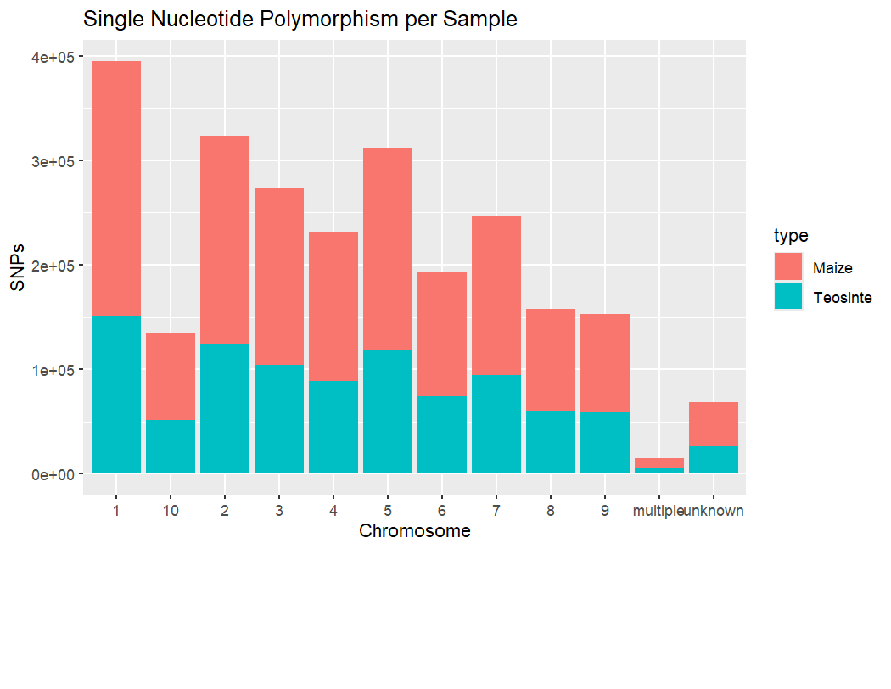

```{r setup, include=FALSE}
knitr::opts_chunk$set(echo = TRUE)
```

Hey Modestos,

I ran your R Markdown file, and everything worked smoothly without errors! I could locate all 40 files, and they were arranged perfectly in order. The graphs looked neat and well-presented—overall, your work is in great shape and ready for submission as is!

I just wanted to share a couple of minor suggestions that might help with efficiency :)

## Data Inspection

You may find it easier to initially clone the **fang & snp_position data** and assign them a name to avoid multiple repeated lines of code. This code in the beginning, saved me a lot of trouble later on.

```         
fang <- read.table("https://raw.githubusercontent.com/EEOB-BioData/BCB546_Spring2025/refs/heads/main/assignments/UNIX_Assignment/fang_et_al_genotypes.txt", header=T, sep="\t")
View(fang)

snp <- read.table("https://raw.githubusercontent.com/EEOB-BioData/BCB546_Spring2025/refs/heads/main/assignments/UNIX_Assignment/snp_position.txt", header=TRUE, sep="\t")
View(snp)
```

This way, you wouldn't have to assign the file path "`Common_files/fang_et_al_genotypes.txt`" every time to inspect it, saving you a lot of time in the long run like below:

```         
data <- read.delim("Common_files/snp_position.txt", sep = "\t", header = TRUE)
head(data)
```

## Data Processing
Your approach works perfectly, but I noticed a way to streamline file names. Instead of creating new files at every step, you could update existing ones when making modifications, which might help keep things more organized.  I've included an example I used to remove the "`JG_OTU`" and "`Group`" info. This way I was able to avoid making new files and keep them streamlined...

```         
Extracted_Maize <- Extracted_Maize[,!names(Extracted_Maize) %in% c("JG_OTU", "Group")]
```

It might be simpler to extract all "`Maize`" and "`Teosinte`" relevant groups in one step this way you could skip repeating the code multiple times and extract these groups just twice. `"ZMMIL","ZMMLR","ZMMMR"` and `"ZMPBA","ZMPIL","ZMPJA"`.

## Data Visualization

For the "SNPs per Chromosome" graph, I initially encountered the same issue with equal SNP counts for Maize and Teosinte. This might be because when I tried checking number of rows using `dim(teosinte_snp)` and `dim(maize_snp)` I got back the same number of rows. After checking the files, I found that reshaping the data using `pivot_longer()` helped show the actual SNP numbers. I've attached the code chunk and the resulting graph I got back. 

```         
fang_new <- fang_new %>% pivot_longer(!c(Sample_ID, Group), names_to="SNP_ID", values_to= "allele")
Subsetted_Teosinte_Maize_2 <- filter(fang_new, Group %in% c("ZMMIL","ZMMLR","ZMMMR","ZMPBA","ZMPIL","ZMPJA"))
SNP_Teosinte_Maize_2 <- merge(Subsetted_Teosinte_Maize_2, Filtered_SNP, by="SNP_ID")
SNP_Teosinte_Maize_Groups <- SNP_Teosinte_Maize_2 %>% 
  mutate(
    type = if_else(
      condition = Group %in% c("ZMMIL","ZMMLR","ZMMMR"), 
      true      = "Maize", 
      false     = "Teosinte"
    ), 
  )

### Graph to compare proportion of SNPs in Maize vs Teosinte
by_group_plot <- ggplot (data = SNP_Teosinte_Maize_Groups) + geom_bar(mapping = aes(x = Chromosome, fill = type)) + 
  xlab(label = "Chromosome") + ylab(label = "SNPs") +
  ggtitle("Single Nucleotide Polymorphism per Sample") 
by_group_plot

### Maize has far exceeding number of SNPs across all Chromosomes when compared to Teosinte.
```

```{r, echo=FALSE, out.width="100%"}

```

These are just small tweaks, and your work is already looking good. Feel free to let me know if you'd like any clarifications, and great job on the file!